# LeadRadar Semantic Query Planner

Статус решения: **локальный alpha реализован; production-архитектура завершена
частично**

Дата проверки: 2026-08-16

Целевой релиз: `v0.4.0`

Текущая реализация: `v0.4.0-alpha.1`. Документ сохраняет целевую схему и явно
отделяет её от того, что уже работает в alpha.

| Блок | Статус alpha |
|---|---|
| Taxonomy 40 concepts, resolver, strict schema/AJV | Реализовано |
| Kimi SSE, `/api/search/plan`, SearchPlan, HMAC confirmation | Реализовано и проверено real API canary |
| Canonical ID -> allowlisted Geoapify categories | Реализовано |
| RU + pilot BY/KZ contract | Реализовано, coverage ещё недостаточен для production |
| Двухфазный search service и полное отделение provider | Частично: adapter сохраняет legacy payload flow |
| Runtime relevance classifier | Не реализован; карточки Kimi не получает |
| Scheduler, admission queue, circuit breaker, global deadline | Не реализовано |
| Production telemetry, auth, quota limiter | Не реализовано |

## 1. Решение

LeadRadar получает отдельное ядро Query Intelligence, которое переводит
свободное описание пользователя в проверяемый план поиска. Kimi не обращается к
картам, не формирует URL и не придумывает категории провайдера. Модель может
только выбрать канонические понятия из переданного ей ограниченного списка.

Ниже показана **целевая схема `v0.4.0`**. Узлы post-search classifier и
выделенного search service ещё не входят в alpha runtime.

```mermaid
flowchart LR
    U["Пользовательский запрос"] --> N["Нормализация намерения"]
    N --> D["Детерминированный resolver"]
    D -->|"точное совпадение"| P["SearchPlan"]
    D -->|"неоднозначно"| K["Kimi constrained resolver"]
    K --> V["Schema + allowlist validation"]
    V -->|"уверенная трактовка"| P
    V -->|"неоднозначно"| C["Подтверждение пользователем"]
    C --> P
    P --> H["Geocoding, если нет center"]
    H --> G["Compiler Geoapify"]
    G --> R["Places -> filter/dedupe -> Details"]
    R --> F["Дедупликация и deterministic relevance"]
    F -->|"только после data-flow gate"| A["Kimi batch classifier"]
    A --> Q["Объяснимая очередь лидов"]
    F -->|"однозначные кандидаты"| Q
```



Главный инвариант:

> `human intent -> canonical concept -> validated SearchPlan -> deterministic
> provider compiler -> source observations -> evidence-based classification`

AI не является источником организаций или контактов. Источником фактов остаётся
картографический провайдер, а AI создаёт только версионированный вывод о смысле и
релевантности.

## 2. Baseline v0.3.1 и оставшийся legacy

До Query Intelligence понимание запроса было полностью смешано с Geoapify.
Alpha вынесла taxonomy, planner и компиляцию категорий, но legacy adapter всё
ещё выполняет geocoding, часть фильтрации/дедупликации и Details:

- прежние regex-правила сохраняются в adapter для обратной совместимости;
- raw `SearchPayload` пока всё ещё доходит до adapter вместе с optional compiled
  plan;
- прямой legacy-вызов provider может по-прежнему закончиться
  `GEOAPIFY_UNSUPPORTED_CATEGORY`, хотя основной UI сначала строит SearchPlan;
- provider-категории ещё участвуют в старой relevance-эвристике;
- explicit RU/BY/KZ уже поддерживаются planner/compiler, но default legacy path
  остаётся российским;
- отдельного post-search классификатора нет.

Поэтому «барбершоп», «мужская парикмахерская» и «место, где стригут мужчин» могут
попасть в разные ветки или не найтись вообще. При этом Geoapify имеет более
широкую категорию `service.beauty.hairdresser`, которая не отделяет барбершоп от
обычной парикмахерской. Один provider selector не решает семантическую задачу.

## 3. Границы ответственности

| Слой | Отвечает за | Не имеет права |
|---|---|---|
| Intent normalizer | Unicode, регистр, язык, опечатки, транслит, лимиты | Выбирать provider-категории |
| Canonical taxonomy | Понятия бизнеса, синонимы, exclusions, локали | Выполнять сетевые запросы |
| Deterministic resolver | Exact/synonym/fuzzy ranking | Угадывать при конфликте |
| Kimi resolver | Выбрать concept ID из разрешённого каталога, объяснить неоднозначность | Создавать ID, URL, контакты или организации |
| Decision policy | `ready`, `needs_confirmation`, `unsupported`, `degraded` | Доверять одной самооценке модели |
| Provider compiler | Concept ID -> allowlisted Geoapify selectors | Принимать raw selector от клиента или модели |
| Provider adapter | Получать SourceObservation | Интерпретировать бизнес-намерение |
| Relevance classifier | `matched/ambiguous/rejected/insufficient_data/not_classified` с evidence | Дополнять отсутствующие факты |

## 4. Каноническая таксономия

Таксономия LeadRadar отделена от любого API карт. В первой версии в неё входят
минимум 30 целевых типов бизнеса. Каждый элемент хранится в Git и проходит code
review.

```ts
export type CanonicalConcept = {
  id: string;
  version: number;
  parentId: string | null;
  labels: Record<string, string>;
  aliases: Record<string, string[]>;
  negativeAliases: Record<string, string[]>;
  physicalPlace: "required" | "optional" | "not_applicable";
  status: "supported" | "experimental" | "unsupported";
};
```

Пример логики, а не готовая запись каталога:

```json
{
  "id": "personal_care.barbershop",
  "labels": { "ru-RU": "Барбершоп" },
  "aliases": {
    "ru-RU": ["барбершоп", "мужская парикмахерская", "мужская стрижка"]
  },
  "negativeAliases": {
    "ru-RU": ["груминг", "стрижка собак", "обучение парикмахеров"]
  },
  "physicalPlace": "required",
  "status": "supported"
}
```

Отдельный provider catalog хранит отображение
`personal_care.barbershop -> geoapify.beauty_hairdresser`. Только этот catalog
знает, что внутренний binding ID компилируется в актуальный Geoapify selector
`service.beauty.hairdresser`. Так canonical taxonomy остаётся независимой от
поставщика, а LLM или клиент не могут подменить категорию произвольной строкой.

Версионируются отдельно:

- `taxonomyVersion`;
- `providerCatalogVersion`;
- `decisionPolicyVersion`;
- `promptVersion`;
- `schemaVersion`.

Support matrix `v0.4.0` сознательно уже, чем весь CIS:

| Country | Locales | Режим |
|---|---|---|
| `RU` | `ru-RU` | supported |
| `BY` | `ru-BY`, `be-BY` | pilot после golden/live gate |
| `KZ` | `ru-KZ`, `kk-KZ` | pilot после golden/live gate |

Один план содержит ровно одну страну. Multi-country и другие страны возвращают
контролируемый `unsupported`; их нельзя молча сводить к `RU`. Расширение матрицы
требует новых taxonomy aliases, provider coverage и отдельного evaluation.

## 5. Контракт SearchPlan

```ts
export type PlanStatus =
  | "ready"
  | "needs_confirmation"
  | "unsupported"
  | "degraded";

export type SearchPlan = {
  schemaVersion: "1.0";
  taxonomyVersion: string;
  providerCatalogVersion: string;
  decisionPolicyVersion: string;
  promptVersion: string;
  requestCacheKey: string;
  planHash: string;
  parentPlanHash: string | null;
  status: PlanStatus;
  intent: {
    description: string;
    primaryQuery: string;
    relatedQueries: string[];
    excludeQueries: string[];
    locale: string;
    countryCodes: ["RU" | "BY" | "KZ"];
  };
  resolution: {
    method: "exact" | "semantic" | "kimi" | "user_confirmed" | "fallback";
    selectedConceptIds: string[];
    alternatives: Array<{
      conceptId: string;
      label: string;
      reasonCodes: string[];
    }>;
    confidenceBand: "high" | "medium" | "low" | "unknown";
    reasonCodes: string[];
    clarificationQuestion: string | null;
  };
  executionPreview: {
    provider: "geoapify";
    categoryLabels: string[];
    batches: number;
  } | null;
  ai: {
    used: boolean;
    modelId: string | null;
    latencyMs: number | null;
    inputTokens: number | null;
    outputTokens: number | null;
    finishReason: string | null;
    validation: "passed" | "failed" | "not_used";
    cacheHit: boolean;
  };
  confirmation: {
    token: string | null;
    expiresAt: string | null;
  };
};
```

`requestCacheKey` идентифицирует только нормализованный intent и версии входного
контракта. `planHash` идентифицирует уже фактически принятый план: он включает
`requestCacheKey`, status, validated resolution, exact model ID, execution
preview и все версии. Поэтому два разных ответа модели не могут выглядеть одним
планом. У плана после пользовательского подтверждения `parentPlanHash` содержит
hash показанного исходного плана, а новый `planHash` включает подтверждённый
concept и `method=user_confirmed`.

Точный алгоритм для обоих hash: списки intent нормализуются, дедуплицируются и
сортируются; объект сериализуется с рекурсивной сортировкой ключей; от UTF-8 bytes
считается SHA-256 в lowercase hex. Arrays, где порядок является частью
контракта, сохраняют порядок. API-ключи, provider responses, контакты и сам
`confirmation.token` в hash не входят.

### JSON encoder boundary

«JSON-энкодер» не является одним prompt, который сразу пишет запрос к карте. Это
четыре проверяемые операции:

1. `IntentEncoder` нормализует поля формы в `RawSearchIntent` и считает
   `requestCacheKey`.
2. `KimiResolutionDecoder` принимает только strict `KimiResolution` JSON,
   повторно валидирует schema/enums и отбрасывает весь ответ при нарушении.
3. `SearchPlanBuilder` применяет decision policy, создаёт immutable `SearchPlan`
   и считает `planHash`.
4. `ProviderCompiler` принимает только validated canonical IDs и строит
   типизированный `GeoapifySearchRequest`; сериализация URL выполняется уже
   адаптером через `URLSearchParams`.

Таким образом, свободный текст и output модели никогда не попадают напрямую в
`categories`, URL или сетевой request. Это главный security и quality boundary
всей системы.

```ts
type GeoapifySearchRequest = {
  providerCatalogVersion: string;
  categoryIds: GeoapifyCategoryId[];
  center: [longitude: number, latitude: number];
  countryCode: "RU" | "BY" | "KZ";
  radiusMeters: number;
  language: "ru" | "be" | "kk";
  limit: number;
};
```

`GeoapifyCategoryId` является compile-time/runtime enum из provider catalog.
Текстовые `primaryQuery/relatedQueries` остаются evidence для объяснения и
оценки релевантности, но не становятся сырыми значениями `categories`.
Если старый payload содержит только `location`, search service сначала вызывает
provider geocoder с типизированным `{location, countryCode, language}`, а затем
создаёт final request с координатами. Поэтому adapter никогда не выбирает страну
по умолчанию самостоятельно.

Provider flow двухфазный: `searchPlaces()` возвращает лёгкие observations, затем
search service применяет `CompiledCandidateFilter`, radius/country validation и
dedupe, и только потом вызывает `fetchDetails()` для отобранных IDs. Exclusions
нормализуются отдельным deterministic compiler в список терминов и допустимых
полей `name/address/providerCategoryIds`; raw regex или provider syntax от
клиента запрещены. Это сохраняет старое `excludeQueries` поведение и не тратит
Details quota на заведомо исключённые карточки.

## 6. Kimi contract

Модель получает:

1. Нормализованный пользовательский intent как недоверенные данные.
2. До 20 lexical candidates, если ranking нашёл правдоподобный shortlist.
3. Если lexical shortlist пуст или слаб, весь компактный каталог поддерживаемых
   concept IDs, но не более 60 элементов в `v0.4.0`.
4. Описания и negative aliases переданных concepts.
5. Строгую JSON Schema, где `conceptId` является enum только из переданного
   набора.

Это принципиально для zero-token-overlap формулировок вроде «место, где стригут
мужчин». При росте каталога свыше 60 concepts сначала вводится проверяемый
embedding retrieval; молча обрезать полный каталог по алфавиту запрещено.

Модель возвращает только:

```ts
type KimiResolution = {
  status: "selected" | "ambiguous" | "unsupported";
  selectedConceptIds: string[];
  alternatives: Array<{
    conceptId: string;
    reasonCodes: string[];
  }>;
  confidenceBand: "high" | "medium" | "low";
  clarificationReasonCode: string | null;
};
```

Обязательные ограничения:

- `response_format.type = "json_schema"`;
- `json_schema.strict = true`;
- `additionalProperties = false`;
- поля для отсутствующих данных допускают `null`;
- разбирается только `choices[0].message.content`;
- `finish_reason !== "stop"` считается ошибкой;
- ответ повторно валидируется локально;
- любой ID вне переданного каталога отклоняет весь AI-ответ;
- prompt injection внутри пользовательского текста не меняет системные правила.

Канонический JSON Schema хранится отдельным artifact в Git. Он задаёт enum для
всех ID/reason codes, `minItems`, `maxItems`, `uniqueItems`, пределы строк и
`additionalProperties: false` на каждом вложенном object. Release gate включает
локальную AJV-проверку и static-проверку Moonshot Flavored JSON Schema официальным
`walle`; пример TypeScript выше не является schema source of truth.

Kimi request использует `stream: true`: клиент накапливает только
`delta.content`, игнорирует `reasoning_content`, принимает итоговые usage и
finish reason из последнего SSE event и требует `[DONE]`. Оборванный stream не
считается частично валидным JSON.

## 7. Политика моделей Kimi

Проверено по официальной документации Moonshot 2026-08-16. Фактический каталог
аккаунта всегда подтверждается через `GET /v1/models`.

| Задача | Кандидат | Context | Цена за 1M tokens: cache/input/output | Начальная политика |
|---|---|---:|---:|---|
| Планирование intent | `kimi-k3` | 1M | `$0.30 / $3.00 / $15.00` | Primary-кандидат, `reasoning_effort: low` |
| Schema benchmark | `kimi-k2.7-code` | 256K | `$0.19 / $0.95 / $4.00` | Сравнить на русском golden set; не runtime fallback без измерений |
| Batch-классификация POI | `kimi-k2.6` | 256K | `$0.16 / $0.95 / $4.00` | Кандидат после data-flow gate; по умолчанию выключен |
| Latency candidate | `kimi-k2.7-code-highspeed` | 256K | `$0.38 / $1.90 / $8.00` | Только если обычная модель не проходит p95 и экономика сходится |

Это стартовая гипотеза, а не навсегда закреплённый выбор. Перед релизом одинаковый
hidden benchmark выбирает модель по порядку: hard safety gates, accuracy,
стабильность, latency, стоимость. Старые K2, `kimi-latest`, K2.5 и Moonshot V1 в
новую архитектуру не входят из-за deprecation/sunset.

Цены зафиксированы как справочная точка на дату документа и перед релизом
перепроверяются; source of truth — актуальные pricing pages и фактический usage в
API response. K3 всегда reasoning-модель; K2.6 позволяет отключить thinking;
K2.7 Code имеет наиболее стабильную поддержку сложных JSON Schema по официальной
документации, но его coding specialization не гарантирует лучший русский
business semantics.

Официальные источники:

- [актуальные модели и deprecations](https://platform.kimi.ai/docs/models);
- [OpenAI Chat Completions compatibility](https://platform.kimi.ai/docs/api/overview);
- [account-specific List Models](https://platform.kimi.ai/docs/api/list-models);
- [Structured Output и различия моделей](https://platform.kimi.ai/docs/guide/response_format);
- [параметры моделей](https://platform.kimi.ai/docs/api/models-overview);
- [rate limits](https://platform.kimi.ai/docs/pricing/limits);
- [K3 pricing](https://platform.kimi.ai/docs/pricing/chat-k3),
  [K2.7 Code pricing](https://platform.kimi.ai/docs/pricing/chat-k27-code) и
  [K2.6 pricing](https://platform.kimi.ai/docs/pricing/chat-k26).

## 8. Decision policy

Поиск запускается автоматически только если:

1. результат exact/synonym resolver однозначен; либо
2. AI-режим прошёл release benchmark, вернул один allowlisted concept, локальная
   schema валидна, конфликтов с negative aliases нет и policy разрешает auto-run.

Во всех остальных случаях:

- `needs_confirmation`: показать до трёх трактовок и не тратить Geoapify quota;
- `unsupported`: объяснить, что нужной карты-категории нет, и предложить ручной
  словарь или другой источник;
- `degraded`: Kimi недоступен, но известный deterministic concept продолжает
  работать; неизвестный intent требует подтверждения.

Самооценка confidence модели не является достаточным основанием для auto-run.
Граница auto-run определяется precision на frozen golden dataset.

Для deterministic shortlist в `v0.4.0` используется фиксированная функция:

- exact normalized alias получает score `1.0`;
- иначе score = `0.6 * token Jaccard + 0.4 * character trigram Dice`;
- кандидат блокируется при совпадении negative alias;
- shortlist содержит top-20 с score не ниже `0.35`;
- deterministic auto-run допустим при score не ниже `0.92`, отрыве от второго
  кандидата не меньше `0.15` и отсутствии negative conflict.

Если shortlist пуст или лучший score ниже `0.35`, это не доказывает
`unsupported`: Kimi получает весь компактный allowlisted каталог. Статус
`unsupported` допустим только после semantic decision либо, если Kimi недоступен,
как контролируемый результат с предложением уточнить категорию. Ни один
`needs_confirmation` intent не может автоматически вызвать provider: допустимый
unsafe auto-run равен нулю.

Пороги меняются только новой `decisionPolicyVersion` и после offline evaluation.

## 9. Post-search classification

Сначала все карточки проходят дешёвые правила. В `v0.4.0` это обязательный и
достаточный путь. Kimi может получить только спорные карточки, максимум 20 за
один интерактивный batch, и только после отдельного data-flow gate. До его
закрытия `KIMI_LEAD_CLASSIFICATION_ENABLED=false`, а поиск возвращает результат
правил или `not_classified`.

```ts
type CandidateEvidence = {
  candidateId: string;
  name: string | null;
  providerCategoryIds: string[];
  locality: string | null;
  sourceDescription: string | null;
};

type LeadRelevance = {
  candidateId: string;
  status:
    | "matched"
    | "ambiguous"
    | "rejected"
    | "insufficient_data"
    | "not_classified";
  method: "rules" | "kimi" | "not_run";
  reasonCodes: string[];
  evidencePointers: string[];
};
```

`CandidateEvidence` строится сервером из нормализованного `Lead` и
`LeadSourceObservation`: имя, provider category IDs, только locality без улицы и
номера дома, короткое provider description. Разрешённые evidence pointers
ссылаются только на эти поля. Телефон, email, сайт, полный адрес, raw response и
notes пользователя в Kimi не отправляются. Если evidence нет, ответом может быть
только `insufficient_data`.

**Kimi data-flow gate.** До передачи реальных карточек документируются поля,
право на их передачу по условиям источника, возможные персональные или
конфиденциальные сведения, применимые уведомления/согласия, трансграничная
обработка и допустимый режим Customer Content. Если обычные условия Kimi не
подходят, classifier остаётся выключенным до письменного enterprise/no-training
соглашения либо получает минимизированные данные без прямых идентификаторов.
Решение принимается отдельно для каждой страны и не заменяет юридическую
консультацию. Основание для gate: [Kimi Terms](https://platform.kimi.ai/docs/agreement/modeluse)
и [Privacy Policy](https://platform.kimi.ai/docs/agreement/userprivacy).

## 10. API и обратная совместимость

Новый `POST /api/search/plan` принимает текущий `SearchPayload` плюс optional
`locale` и `countryCodes`. В `v0.4.0` разрешена ровно одна страна из support
matrix. Endpoint не вызывает Geoapify и возвращает `SearchPlan`.

Текущий `POST /api/search` и `POST /api/search?stream=1` сохраняются. В payload
добавляются optional `confirmedConceptIds` и `confirmationToken`. Для
`needs_confirmation` сервер принимает выбор только с неистёкшим подписанным
token и проверяет, что IDs входили в alternatives именно этого плана. Token
stateless и self-contained:

```text
base64url(canonical JSON claims).base64url(HMAC-SHA256(secret, claimsPart))
```

Claims содержат version token, `requestCacheKey`, `sourcePlanHash`, allowed
concept IDs, taxonomy/catalog/policy versions, `iat` и `exp`; TTL 10 минут.
Сервер проверяет подпись constant-time, expiry, совпадение cache key с новым raw
intent и принадлежность выбранных IDs к allowed set. После этого строится новый
confirmed plan с `parentPlanHash=sourcePlanHash`. Хранить исходный plan на одном
worker для верификации не требуется. Ключ подписи хранится только server-side.
Старый payload без новых полей получает default `ru-RU` и `RU`.

Успешный `ready` или executable `degraded` поиск по-прежнему возвращает
`SearchResponse` с optional `plan`. `degraded` executable только когда
allowlisted deterministic concept уже известен, но optional AI capability
недоступна. Если безопасного concept нет, результатом становится
`needs_confirmation` или `unsupported`, а не `degraded`. Semantic outcomes имеют
явный discriminated error contract:

- HTTP `409`, `code=SEARCH_PLAN_CONFIRMATION_REQUIRED`, `plan` — неоднозначность;
- HTTP `422`, `code=SEARCH_PLAN_UNSUPPORTED`, `plan` — неподдерживаемый intent;
- HTTP `429` с `Retry-After` — внешний request/auth/product quota limiter не
  допустил сам search job.

В NDJSON это одна terminal-запись `type=error` с тем же `code` и optional `plan`.
Старые клиенты продолжают понимать `error`, новые показывают alternatives. Ни в
одном semantic outcome фиктивный `SearchResponse` не создаётся.

В `SearchResponse` добавляются optional:

- `plan`;
- `Lead.relevance`;
- AI metadata без reasoning и raw content.

Kimi не меняет `mode/provider`: источником данных остаётся `geoapify`.

Новые progress stages:

1. `intent_resolution`;
2. `geocoding`, если center не задан;
3. `provider_compilation`;
4. существующие `places`, `details`, `normalizing`;
5. `relevance_classification`;
6. `complete`.

## 11. Отказы и fallback

| Сбой | Поведение |
|---|---|
| Kimi timeout/429/5xx/network | Tier-0: без retry, сразу deterministic/confirmation; production: максимум один bounded retry при оставшемся бюджете |
| Kimi invalid JSON/schema | Отклонить ответ целиком; не запускать provider по нему |
| Model ID отсутствует в `/models` | AI capability unavailable; health не падает в 500 |
| Неизвестный concept | `unsupported` или `needs_confirmation` |
| Geoapify timeout/429/5xx | Существующий provider error; будущий provider fallback проектируется отдельно |
| Классификатор не успел | Вернуть базовые результаты с `not_classified`; не терять найденные POI |
| Пользователь отменил stream | AbortSignal отменяет Kimi и provider fetches |

Автоматический переход на вторую Kimi-модель не включается до измерения: на
начальном тарифе дополнительный вызов может исчерпать RPM и увеличить задержку.

Один global `AbortSignal` ограничивает всю операцию. У local pilot Tier-0 global
deadline равен 60 с: Kimi inference 30 с, geocoding 5 с, Places 7 с, Details 15
с, normalization 1 с. У production profile после перехода минимум на Tier-1
deadline равен 45 с: planning 12 с, geocoding + Places 12 с, Details 10 с,
optional classifier 8 с, normalization 1 с. Global deadline всегда имеет
приоритет над stage timeout.

Стандартные автоматические retries SDK выключаются (`maxRetries=0`). В Tier-0
сбой сразу ведёт в safe fallback. В production разрешён максимум один собственный
retry для network/429/5xx, если в stage и global budget остаётся не менее 3 с;
`Retry-After` учитывается, но задержка ограничена 1,5 с плюс jitter.

Начальная capacity policy под Tier-0: concurrency Kimi `1`, минимальный интервал
между стартами 20 с, один ожидающий запрос и ожидание admission максимум 20 с.
Если слот не появился, запрос получает deterministic fallback или
`needs_confirmation`, а не продолжает spinner. Один интерактивный поиск делает
не более одного Kimi-call; post-search AI выключен. Пределы задаются server-side
конфигурацией по фактическому tier и никогда не повышаются автоматически.
Circuit breaker открывается на 60 с после пяти transient failures за 60 с и
допускает один half-open probe.

Переполнение внутренней Kimi-очереди не возвращает HTTP 429: job уже принят и
заканчивается safe semantic fallback с reason code `KIMI_ADMISSION_TIMEOUT`.
HTTP 429 зарезервирован для внешнего limiter до принятия job.

Admission wait входит в global deadline. Каждый stage получает только
`min(stageBudget, remainingGlobalBudget)`; перечисленные максимумы не
суммируются сверх 60/45 секунд.

## 12. SLO и будущий SLA

Moonshot не публикует обычную p95 latency или contractual SLA. До собственных
измерений LeadRadar использует внутренний SLO, а не обещает внешний SLA. Tier-0
и Geoapify Free подходят для личного пилота, но не для многопользовательского
обещания времени ответа.

| SLI | Local pilot Tier-0 | Production target после Tier-1 |
|---|---:|---:|
| Первый progress event | p95 <= 0,5 с | p95 <= 0,3 с |
| Пауза между progress events | <= 2 с для 99% long-running jobs | <= 2 с |
| Deterministic plan | p95 <= 150 мс | p95 <= 100 мс |
| Kimi inference | calibration p95 <= 20 с; timeout 30 с | p95 <= 8 с; timeout 12 с |
| Fast path без Kimi, полная базовая выдача | p95 <= 15 с | p95 <= 12 с |
| Kimi-assisted, полная базовая выдача | p95 <= 55 с | p95 <= 25 с |
| Global terminal deadline | 60 с | 45 с |

После global deadline запрос обязан завершиться результатом, partial result или
контролируемым бизнес-статусом. Бесконечного spinner быть не должно. Для личного
пилота честный текст — «известная категория обычно до 15 секунд; новая
формулировка с AI может занять до минуты». После Tier-1 целевой продуктовый текст
— «обычно до 30 секунд; максимум 45 секунд».

Первые 500 live jobs за 7 дней нужны только для калибровки пилотного SLO. Это не
основание для договорного SLA.

Перед внешним SLA нужны минимум 10 000 репрезентативных jobs за 28 дней и нижняя
95%-я доверительная граница целевой метрики не ниже обещанного уровня. Метрики
разделяются:

- terminality: доля принятых jobs с terminal response в пределах deadline
  активного profile (`60 с` local, `45 с` production);
- provider completion: доля валидных, допущенных и не отменённых jobs, где
  provider завершил запрос успехом, включая корректный пустой результат;
- latency: p95 только среди provider-completed jobs;
- details completeness: отдельная доля `checked/not_checked`, не маскируемая как
  «данных нет».

Контролируемая быстрая ошибка выполняет terminality, но не provider completion.
Отказы upstream не скрываются и входят в отдельный reason-code breakdown.

## 13. Наблюдаемость и стоимость

Для каждого AI-вызова сохраняются только безопасные metadata:

- request ID и hashed intent ID;
- queue wait, stage durations, deadline/abort reason;
- model ID;
- schema/prompt/taxonomy/catalog/policy versions;
- latency, token usage, cache tokens, finish reason;
- validation result, fallback reason, status;
- ориентировочная стоимость.

Не логируются ключ, Authorization header, reasoning content, полный prompt,
телефоны, email, сайты, raw lead payload или полный ответ Kimi.

Начальные cost gates:

- не более 3000 input tokens, 300 final JSON content tokens и p95 1200 total
  completion tokens с учётом reasoning на planner;
- не более `$0.02` на один AI-assisted plan;
- не более `$0.10` на классификацию 100 лидов;
- не более одного Kimi-вызова в интерактивном planner;
- повтор идентичного intent при совпадении версий в пределах одного worker
  instance использует bounded LRU cache и не делает новый AI-вызов.

Текущий alpha cache находится внутри `planner.ts`: максимум 200 планов, TTL 10
минут и versioned runtime key. Он не содержит raw Kimi response или reasoning и
нужен прежде всего, чтобы UI-вызовы `/plan` и `/search` не делали два одинаковых
Kimi-запроса. Cache является ускорением, а не гарантированным хранилищем: cold
start может вызвать новый запрос. Целевая production-политика 500 semantic
resolutions/24 часа и durable cache остаются частью будущего database design.

## 14. Security и policy

- Ключ хранится только как `MOONSHOT_API_KEY` server-side, без `NEXT_PUBLIC_`.
- Подпись confirmation token использует отдельный server-side
  `SEARCH_PLAN_SIGNING_SECRET`.
- Kimi включается отдельным `QUERY_INTELLIGENCE_MODE=kimi`; отсутствие ключа не
  ломает deterministic path.
- Post-search Kimi включается независимым
  `KIMI_LEAD_CLASSIFICATION_ENABLED=false` только после data-flow gate.
- Все входы имеют length/item limits и рассматриваются как untrusted data.
- Provider selectors компилируются только из Git-allowlist.
- Запрещено сохранять raw Kimi/provider responses в Git, localStorage и fixtures.
- Перед внешним deployment нужны server auth, quota limit и circuit breaker.
- AI provenance не подменяет source provenance.

## 15. Initial canary и оставшееся неизвестное

На пользовательском ключе подтверждены доступность `kimi-k3`,
`kimi-k2.7-code`, `kimi-k2.7-code-highspeed` и `kimi-k2.6`, strict Structured
Output, входящий SSE и несколько обычных RU/BY/KZ semantic cases. Полный
Kimi → Geoapify поток и confirmation для неоднозначного «склад» также прошли.

Этого недостаточно для production gate. Всё ещё не подтверждены:

- качество русского, транслита и CIS-терминов на hidden выборке нужного размера;
- p50/p95/p99, фактический account tier и устойчивость под concurrency;
- schema/semantic stability на 100 live intents/model и 30×3 hard cases;
- фактическая стоимость production-корпуса; initial canary из пяти вызовов
  использовал 15 399 input / 355 output tokens и стоил оценочно $0,051522, но
  четыре вызова не уложились либо вплотную подошли к input target `≤ 3000`;
- SLO heartbeat/deadline, scheduler/circuit breaker и provider completion;
- post-search data-flow и classifier.

Эти пункты остаются обязательными production release gates, а не допущениями.
